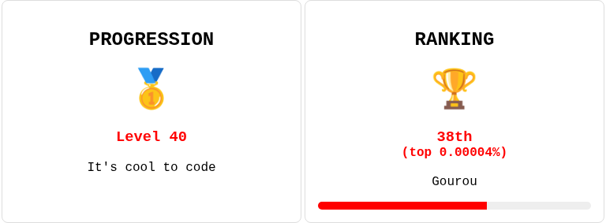

<!-- PROJECT LOGO -->
 

  

<h3 align="center">Esteban MATHIA</h3>
  

    I'm Esteban Mathia, a passionate software developer currently working at Innovtech. I'm an active member of several organizations and actively contribute
     
    <a href="https://github.com/estebanmathia/MyREADME"><strong>Explore »</strong></a>
     
     
    <a href="https://github.com/estebanmathia/MyREADME">View</a>
    ·
    <a href="https://github.com/estebanmathia/MyREADME/issues">Report Bug</a>
    ·
    <a href="https://github.com/estebanmathia/MyREADME/issues">Request Feature</a>
  

<!-- TABLE OF CONTENTS -->

  
Table of Contents

  <ol>
    <li>
      <a href="#streak">Streak</a>
    </li>
    <li>
      <a href="#codingame">Codingame</a>
    </li>
    <li>
      <a href="#organizations">Organizations</a>
    </li>
    <li>
      <a href="#open-source-contributions">Open Source Contributions</a>
    </li>
    <li>
        <a href="#technologies">Technologies</a>
        <ul>
            <li><a href="#programming-languages">Programming Languages</a></li>
            <li><a href="#front-end-development">Front-End Development</a></li>
            <li><a href="#back-end-development">Back-End Development</a></li>
            <li><a href="#database">Database</a></li>
            <li><a href="#devops">DevOps</a></li>
            <li><a href="#cloud-services">Cloud Services</a></li>
            <li><a href="#version-control">Version Control</a></li>
        </ul>
    </li>
    <li><a href="#contact-me">Contact Me</a></li>
    <li><a href="#visitor-count">Visitor count</a></li>
  </ol>

## Streak

(<a href="#top">back to top</a>)

## Codingame

<a href="https://www.codingame.com/profile/5188bb237cbb02e049ab6edb8fc18d8b1763755">

  

</a>

(<a href="#top">back to top</a>)

## Organizations
Here are some of the organizations I'm proud to be a part of:
- [4urCloud](https://github.com/4urcloud)
- [TheCloudPrices](https://github.com/thecloudprices)
- [Kexa-io](https://github.com/kexa-io)

(<a href="#top">back to top</a>)

## Open Source Contributions
I enjoy giving back to the community and have contributed to the following open-source projects:
- [Kexa](https://github.com/kexa-io/Kexa)
- [Kexa Github Action](https://github.com/kexa-io/git-action)

(<a href="#top">back to top</a>)

## Technologies

I work with a wide range of technologies in my repositories, including but not limited to:

- ### Programming Languages
    - [![TypeScript][ts-shield]](https://www.typescriptlang.org/docs/)
    - [![Python][python-shield]](https://www.typescriptlang.org/docs/)
    - [![C#][C#-shield]](https://learn.microsoft.com/fr-fr/dotnet/csharp/)

- ### Front-End Development
    - [![VUE][VUE-shield]](https://vuejs.org/)
    - [![REACT][REACT-shield]](https://fr.legacy.reactjs.org/)

- ### Back-End Development
    - [![NODE][NODE-shield]](https://nodejs.org/fr)
    - [![EXPRESS][EXPRESS-shield]](https://expressjs.com/fr/)
    - [![FLASK][FLASK-shield]](https://flask.palletsprojects.com/en/2.3.x/)

- ### Database
    - [![MYSQL][MYSQL-shield]](https://www.mysql.com/fr/)
    - [![MONGODB][MONGODB-shield]](https://www.mongodb.com/fr-fr)
    - [![POSTGRESQL][POSTGRESQL-shield]](https://www.postgresql.org/)

- ### DevOps
    - [![DOCKER][DOCKER-shield]](https://www.docker.com/)
    - [![KUBERNETES][KUBERNETES-shield]](https://kubernetes.io/fr/)
    - [![HELM][HELM-shield]](https://helm.sh/)
    - [![ARGOCD][ARGOCD-shield]](https://argo-cd.readthedocs.io/en/stable/)
    - [![TERRAFORM][TERRAFORM-shield]](https://www.terraform.io/)

- ### Cloud Services
    - [![AZURE][AZURE-shield]](https://azure.microsoft.com/fr-fr/free/search/)
    - [![AWS][AWS-shield]](https://aws.amazon.com/fr/free/)
    - [![GCP][GCP-shield]](https://cloud.google.com/gcp/)

- ### Version Control
    - [![GIT][GIT-shield]](https://github.com/)
    - [![GITHUB][GITHUB-shield]](https://github.com/)

(<a href="#top">back to top</a>)

## Contact me

Esteban MATHIA - [esteban.mathia@supinfo.com](mailto:esteban.mathia@supinfo.com) - [![LinkedIn][linkedin-shield]](https://www.linkedin.com/in/esteban-mathia-aa21801ba/)

(<a href="#top">back to top</a>)

## Visitor count

Added the `Fri 15 Sep 2023`

Last update on Mon Oct 21 2024

Turning caffeine into code since 2019. ☕💻

(<a href="#top">back to top</a>)

[linkedin-shield]: https://img.shields.io/badge/-LinkedIn-black.svg?style=for-the-badge&logo=linkedin&colorB=555
[ts-shield]: https://img.shields.io/badge/TypeScript-007ACC?style=for-the-badge&logo=typescript&logoColor=white
[python-shield]: https://img.shields.io/badge/Python-3776AB?style=for-the-badge&logo=python&logoColor=white
[C#-shield]: https://img.shields.io/badge/C%23-239120?style=for-the-badge&logo=c-sharp&logoColor=white
[HTML-shield]: https://img.shields.io/badge/HTML5-E34F26?style=for-the-badge&logo=html5&logoColor=white
[CSS-shield]: https://img.shields.io/badge/CSS3-1572B6?style=for-the-badge&logo=css3&logoColor=white
[REACT-shield]: https://img.shields.io/badge/React-20232A?style=for-the-badge&logo=react&logoColor=61DAFB
[VUE-shield]: https://img.shields.io/badge/Vue.js-35495E?style=for-the-badge&logo=vue.js&logoColor=4FC08D
[NODE-shield]: https://img.shields.io/badge/Node.js-43853D?style=for-the-badge&logo=node.js&logoColor=white
[EXPRESS-shield]: https://img.shields.io/badge/Express.js-404D59?style=for-the-badge
[FLASK-shield]: https://img.shields.io/badge/Flask-000000?style=for-the-badge&logo=flask&logoColor=white
[MYSQL-shield]:https://img.shields.io/badge/MySQL-00000F?style=for-the-badge&logo=mysql&logoColor=white
[MONGODB-shield]:https://img.shields.io/badge/MongoDB-4EA94B?style=for-the-badge&logo=mongodb&logoColor=white
[POSTGRESQL-shield]:https://img.shields.io/badge/PostgreSQL-316192?style=for-the-badge&logo=postgresql&logoColor=white
[DOCKER-shield]: https://img.shields.io/badge/DOCKER-2596be?style=for-the-badge
[KUBERNETES-shield]: https://img.shields.io/badge/KUBERNETES-346ce4?style=for-the-badge
[HELM-shield]: https://img.shields.io/badge/HELM-2596be?style=for-the-badge
[ARGOCD-shield]: https://img.shields.io/badge/ARGOCD-fb733c?style=for-the-badge
[TERRAFORM-shield]: https://img.shields.io/badge/TERRAFORM-5c44ec?style=for-the-badge
[AZURE-shield]: https://img.shields.io/badge/Microsoft_Azure-0089D6?style=for-the-badge&logo=microsoft-azure&logoColor=white
[AWS-shield]: https://img.shields.io/badge/Amazon_AWS-FF9900?style=for-the-badge&logo=amazonaws&logoColor=white
[GCP-shield]: https://img.shields.io/badge/Google_Cloud-4285F4?style=for-the-badge&logo=google-cloud&logoColor=white
[GIT-shield]:https://img.shields.io/badge/GIT-E44C30?style=for-the-badge&logo=git&logoColor=white
[GITHUB-shield]: https://img.shields.io/badge/GitHub_Actions-2088FF?style=for-the-badge&logo=github-actions&logoColor=white
